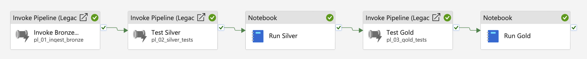
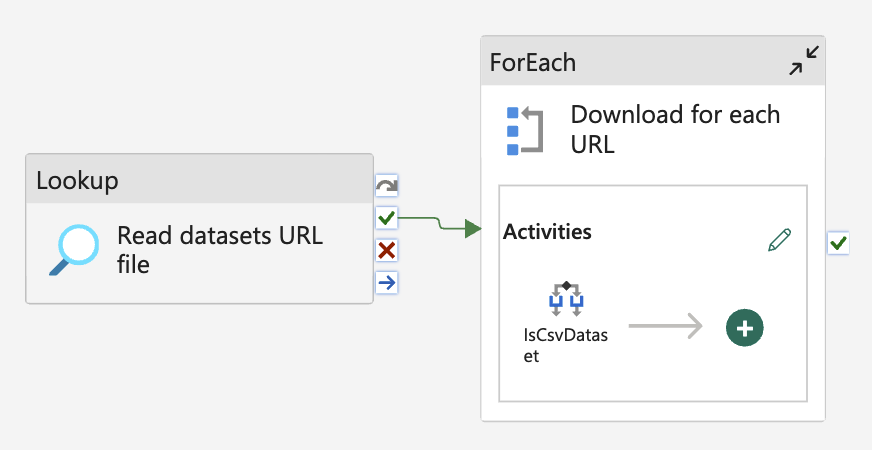
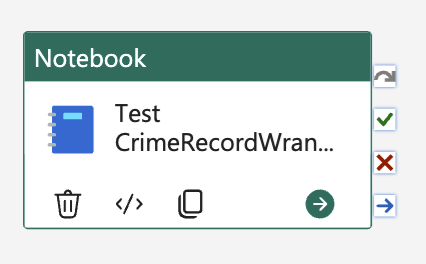
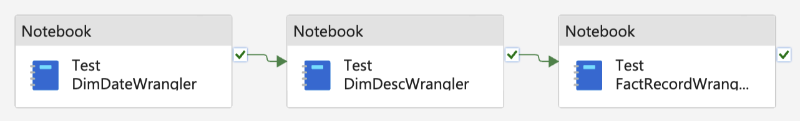
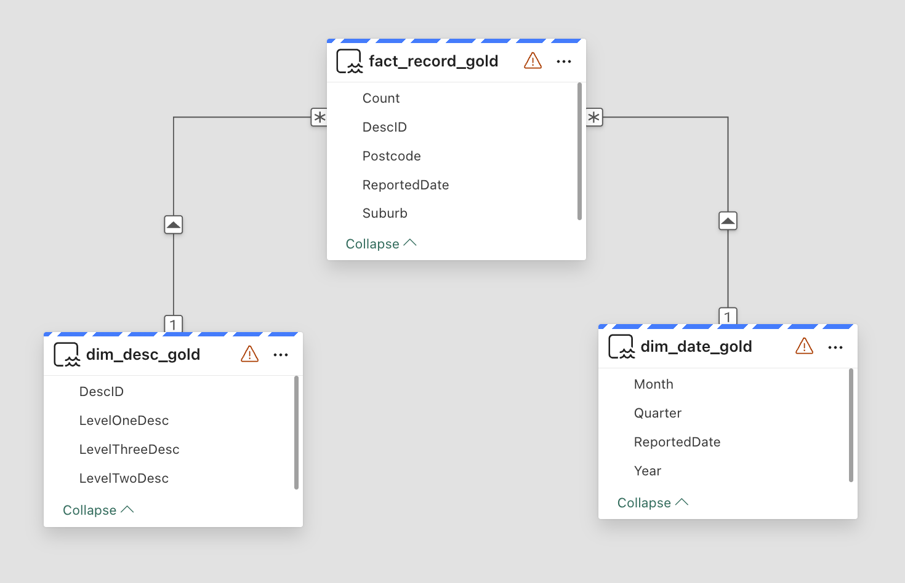
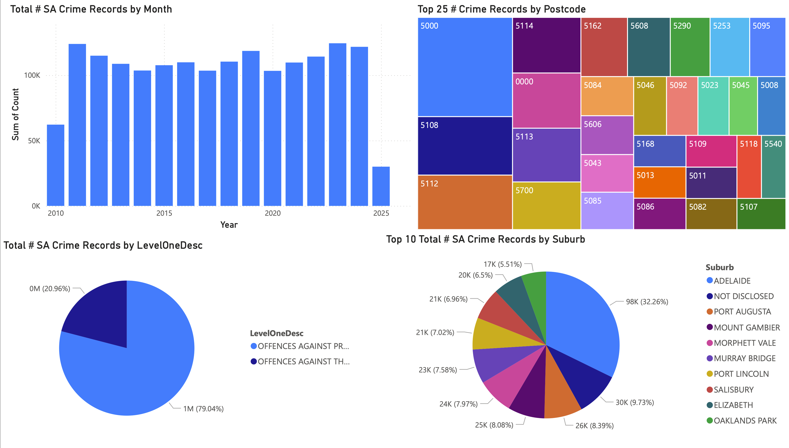

# Fabric Medallion Architecture Demo

A demo showing simple [ETL](https://learn.microsoft.com/en-us/azure/architecture/data-guide/relational-data/etl) (extract, transform and load) process utilizing [Medallion architecture](https://learn.microsoft.com/en-us/azure/databricks/lakehouse/medallion) on Microsoft Fabric platform. The features include:

- Test-driven development (on silver and gold layers using Notebooks)
- Use [South Australia crime statistics](https://data.sa.gov.au/data/dataset/crime-statistics) (daily records, July 2010 to March 2025)
- Simple Power BI dashboard demo
- TODO: Analysis with SA economical statistics, etc

## Project details:

<details open>

<summary>`pl_00_medallion.json` file</summary>

- [`pl_00_medallion.json`](./pl_00_medallion.json): The complete medallion pipeline, including the pipelines and Notebook activities for each stage (bronze, test silver, silver, test gold and gold).

	

</details>

 <br>

<details open>

<summary>`01_bronze` directory</summary>

- [`nb_01_ingest_bronze.ipynb`](./01_bronze/nb_01_ingest_bronze.ipynb): a notebook to download SA crime records (unused).
- [`pl_01_ingest_bronze.json`](./01_bronze/pl_01_ingest_bronze.json): a `JSON` pipeline file to download raw data from [Data SA](https://data.sa.gov.au/data/dataset/crime-statistics), including `.csv` and `.xlsx` files.

	

	`ForEach` activity contains `Copy Data` activities to fetch `.csv` (delimited text format) and `.xlsx` (binary file) files given the datasets urls ([`datasource/sa_crime_data_urls.csv`](./data_source/sa_crime_data_urls.csv)).

</details>

 <br>

<details open>
<summary>`02_silver` directory</summary>

The silver stage that ingests 10+ crime record files into the lakehouse, along with data cleansing.

- [`nb_02_sa_crime_record_wrangler.ipynb`](./02_silver/nb_02_sa_crime_record_wrangler.ipynb): class to clease and ingest SA crime records data
- [`nb_02_sa_crime_record_wrangler_tests.ipynb`](./02_silver/nb_02_sa_crime_record_wrangler_tests.ipynb): test units to test the wranger class.

	Call `%run` to import the classes from another notebook file, i.e. `SACrimeRecordWrangler` class.

	```
	%run nb_02_sa_crime_record_wrangler
	```

- [`nb_02_cleanse_silver.ipynb`](./02_silver/nb_02_cleanse_silver.ipynb): notebook to execute the ingestion and cleansing codes (two `Lakehouse`s are created, one for testing (`lh_sa_crime_test`) and another for actual data (`lh_sa_crime`))
- [`pl_02_silver_tests.json`](./02_silver/pl_02_silver_tests.json): date pipeline file for the silver stage:

	

</details>

 <br>

<details open>
<summary>`03_gold` directory</summary>

The golden stage that transforms crime records (fact table), date (dimenstion) and offence description (dimension) tables for further analysis. Similar to the silver stage, `*_tests.ipynb` notebooks test the wrangler classes (`*_wrangler.ipynb`):

- [`nb_03_dim_date_wrangler.ipynb`](./03_gold/nb_03_dim_date_wrangler.ipynb)
- [`nb_03_dim_date_wrangler_tests.ipynb`](./03_gold/nb_03_dim_date_wrangler_tests.ipynb)
- [`nb_03_dim_desc_wrangler.ipynb`](./03_gold/nb_03_dim_desc_wrangler.ipynb)
- [`nb_03_dim_desc_wrangler_tests.ipynb`](./03_gold/nb_03_dim_desc_wrangler_tests.ipynb)
- [`nb_03_fact_record_wrangler.ipynb`](./03_gold/nb_03_fact_record_wrangler.ipynb)
- [`nb_03_fact_record_wrangler_tests.ipynb`](./03_gold/nb_03_fact_record_wrangler_tests.ipynb)

 <br>

- [`nb_03_crime_record_gold.ipynb`](./03_gold/nb_03_crime_record_gold.ipynb): calls the wranglers in order (`dim_date`, `dim_desc`, and `fact_crime_record`).

	For example, in `nb_03_crime_record_gold.ipynb`:

	```python
	%run nb_03_dim_date_wrangler
		
	dim_date_gold_df = DimDateWrangler.extract_silver_df(silver_df)
	DimDateWrangler.create_delta_table(spark, date_gold_table_name)

	dim_date_table = DeltaTable.forName(spark, date_gold_table_name)
	DimDateWrangler.upsert_delta_table(dim_date_table, dim_date_gold_df)
	```

- [`pl_03_gold_tests.json`](./02_silver/pl_03_gold_tests.json): date pipeline file for the gold stage:

	

- The transformed sementic model:

	

</details>

 <br>

<details open>
<summary>Naming convention</summary>

| Workspace item naming  | Format                                           |
| ---------------------- | ------------------------------------------------ |
| Lakehouse              | `lh_<stage_idx>_<description>`                   |
| Notebook test unit     | `nb_<stage_idx>_<description>_tests`             |
| Notebook               | `nb_<stage_idx>_<description>_<medallion_stage>` |
| Directory              | `<stage_idx>_<medallion_stage>`                  |
| Data pipeline activity | `Camel case`                                     |
| Python class name      | `PascalCase`                                     |
| Python function        | `snake_case`                                     |
| Delta table name       | `PascalCase`                                     |

</details>

 <br>

<details>
<summary>Repo directory structure</summary>

```
fabric_sa_crime_records
├── 01_bronze
│   ├── nb_01_ingest_bronze.ipynb
│   └── pl_01_ingest_bronze.json
├── 02_silver
│   ├── nb_02_cleanse_silver.ipynb
│   ├── nb_02_sa_crime_record_wrangler_tests.ipynb
│   ├── nb_02_sa_crime_record_wrangler.ipynb
│   └── pl_02_silver_tests.json
├── 03_gold
│   ├── nb_03_crime_record_gold.ipynb
│   ├── nb_03_dim_date_wrangler_tests.ipynb
│   ├── nb_03_dim_date_wrangler.ipynb
│   ├── nb_03_dim_desc_wrangler_tests.ipynb
│   ├── nb_03_dim_desc_wrangler.ipynb
│   ├── nb_03_fact_record_wrangler_tests.ipynb
│   ├── nb_03_fact_record_wrangler.ipynb
│   └── pl_03_gold_tests.json
├── data_source
│   └── sa_crime_data_urls.csv
└── pl_00_medallion.json
```

</details>

## Simple Power BI dashboard regarding the gold sementic model:

Drill down/up to lower/upper hierarchy is implemented, however the report is not publishable due to the permission issue.



## Todos:

- [x] Medallion ✅ 2025-07-06
	- [x] Bronze ✅ 2025-07-05
	- [x] Silver ✅ 2025-07-05
	- [x] Gold ✅ 2025-07-06
	- [x] Unit tests ✅ 2025-07-06
- [x] Pipelines ✅ 2025-07-06
- [ ] Analytics
	- [ ] Analysis with SA economic indicators
	- [x] Simple Power BI dashboard ✅ 2025-07-06
- [ ] CI/CD
	- [ ] Azure DevOps
	- [ ] Fabric Deployment
	- [ ] Automation
- [ ] ？Linter
- [ ] Logging
- [ ] Security


## Acknowledgements

- [Microsoft Fabric](https://www.microsoft.com/en-us/microsoft-fabric)
- [Fabric Unit Test](https://www.youtube.com/watch?v=Y5f8T_lf77o)
- [Data SA (South Australian Government Data Directory)](https://data.sa.gov.au/data/dataset/crime-statistics)